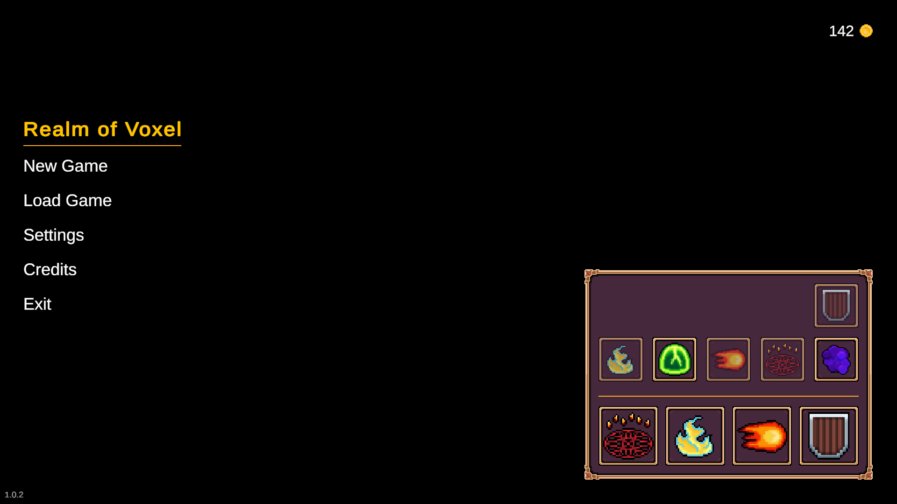
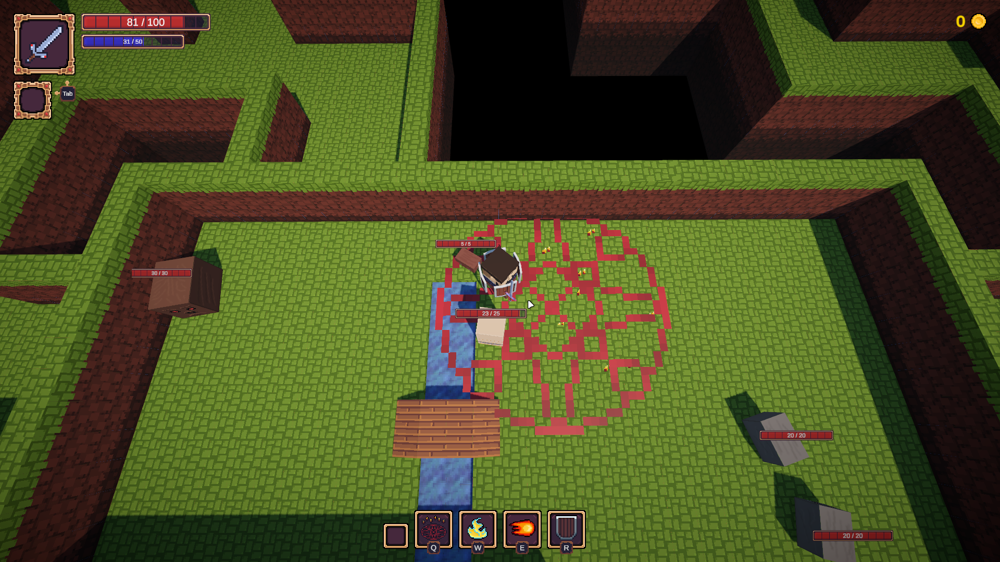

# Realm of Voxel

**Realm of Voxel** — це дипломна гра в жанрі *Rogue-like*, створена в Unity з використанням воксельної та піксельної графіки, натхненної Minecraft. Гравець керує персонажем з виглядом зверху, досліджує процедурно згенеровані рівні, бореться з ворогами та покращує свої вміння.

## 🎮 Особливості гри

- Воксельна графіка у стилі Minecraft
- Rogue-like механіка з процедурною генерацією рівнів
- Ігрове управління як у Dota 2 (вид зверху, клік для переміщення)
- Прокачування персонажа
- Піксельний стиль UI та іконок

## 🛠️ Технології

- Unity 2022.3 LTS
- C#
- URP (Universal Render Pipeline)
- Blender (для створення моделей)
- Aseprite (для створення текстур і спрайтів)

## 📥 Завантаження

Останню версію гри можна завантажити з розділу [Releases](https://github.com/zuirseime/RealmOfVoxel/releases):

- 🗂️ Архів зі скомпільованою грою (`RealmOfVoxel.zip`)
- 🖥️ Інсталятор гри для Windows (`Realm Of Voxel Setup (x64).exe`)

> ⚠️ Перед запуском переконайтесь, що у вас встановлено **.NET 6 Runtime** або **Visual C++ Redistributable**, якщо гра не запускається.

## ▶️ Як грати

1. Запустіть `.exe` файл або розпакуйте архів і запустіть гру вручну.
2. Управління:
   - **ПКМ** — рух/атака
   - **F** – взаємодія з обʼєктами
   - **Q / W / E / R** — застосування заклять
   - **Tab** – зміна активної зброї
   - **Escape** – пауза
3. Досліджуйте рівні, збирайте ресурси та перемагайте ворогів.

## 📸 Скріншоти

### Головне меню

### Ігровий процес

## 🧠 Ідея та натхнення

Гру створено як частину дипломного проєкту. Натхненням слугували такі ігри:
- Soul Knight
- The Binding of Isaac
- Enter the Gungeon
- Minecraft

## 📄 Ліцензія

Цей проєкт розповсюджується відповідно до ліцензії MIT. Детальніше — у файлі [LICENSE](LICENSE).

---

